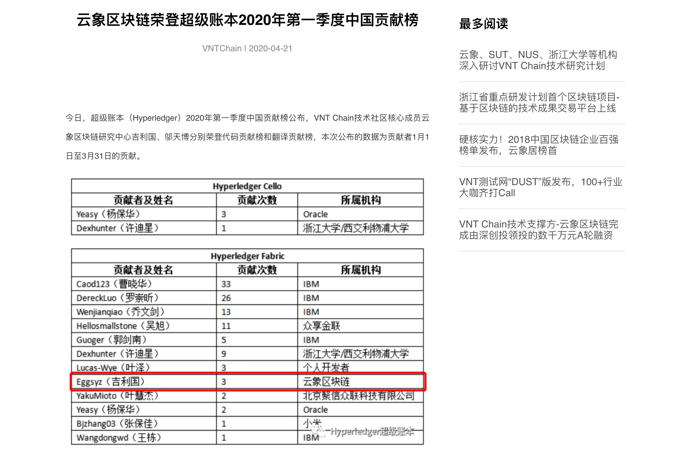
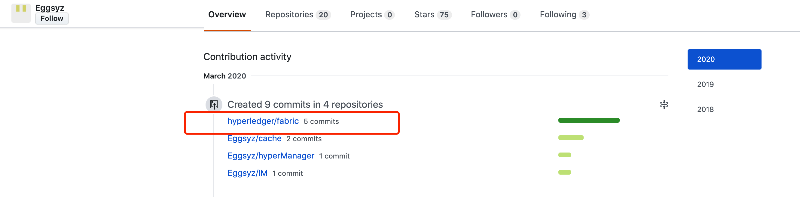
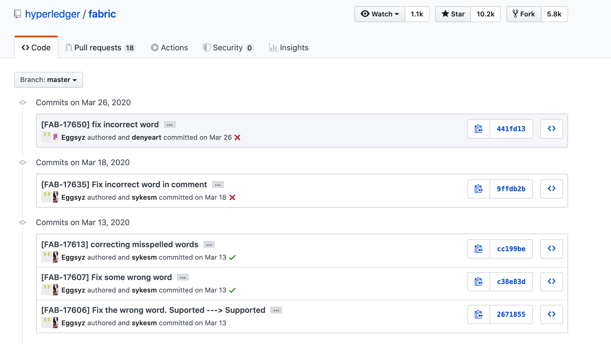
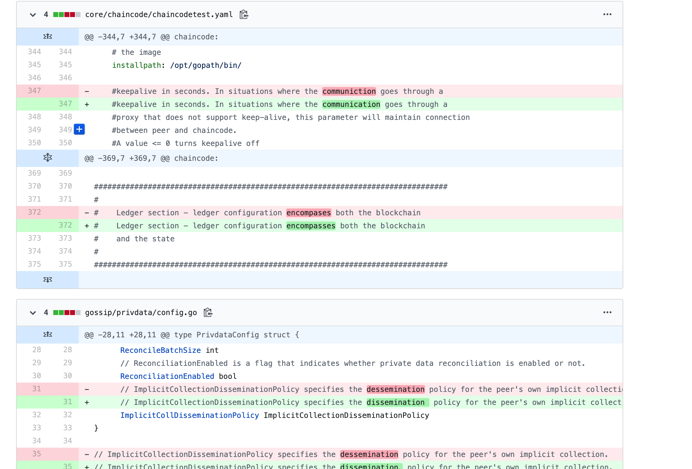
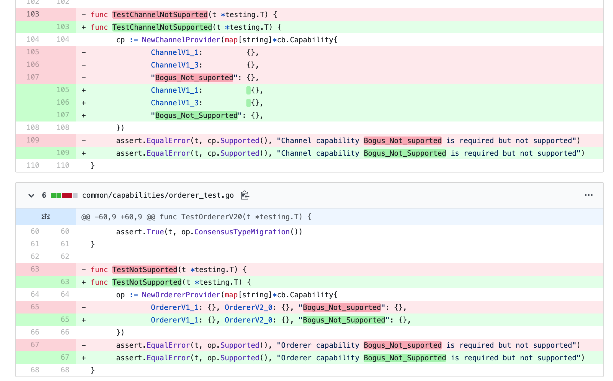

## 手把手教你怎么向Hyperledger Fabric贡献代码

Hyperledger Fabric作为当前最热门的联盟链开源项目，能够提交代码并被采纳是一件非常有成就的事情。
这里拿VNTChain云象（以下简称VNT）举例，为什么呢，因为VNT号称的聚合链架构让我这不懂区块链的小韭菜感觉很牛逼，刚好又在VNT的官网看到提交代码的新闻，本着学习和研究代码的态度，深入了解VNT的贡献。

附上利好链接与截图:
[云象区块链荣登超级账本2020年第一季度中国贡献榜](http://www.vntchain.io/news/detail/5e9ebfc2dfcfdb669bb2e914?language=zh)

从新闻里看到，提交代码的大神的github ID为Eggsyz,为了研究代码，笔者屁颠屁颠的跑到大神的github主页

从截图看到VNT团队的大神提交了5次代码，远远多于新闻里的三次，这也太谦虚了。

接下来终于进入正题，好好研究一下全球顶尖区块链公司贡献的代码。

从提交的记录来看，虽然笔者的英语不怎么样，但还是看的懂一些，这里给翻译一下：

* 修正不正确的单词
* 修正拼写错误的单词
* 修正错误的单词，将Suported 改为 Supported

感觉画风不太对，说好的代码呢，但是本着学习研究负责任的态度，仅仅从标题里看不出什么来，还是应该更深入的进行学习，于是，笔者继续查看详细的代码。

[代码提交链接1](https://github.com/hyperledger/fabric/commit/cc199bed1a4bf18d00c87060f43e05d8c0425032)

[代码提交链接2](https://github.com/hyperledger/fabric/commit/c38e83d207136a3140293e4004691320d174744a)

[代码提交链接3](https://github.com/hyperledger/fabric/commit/2671855a174b0a813168bd29f6dae888feeb2235)

稍微截个图研究一下代码

红色的表示拼错的单词，绿色的表示拼对的单词，IBM团队贡献代码的大神连单词都拼不对，还是VNT团队贡献代码的大神强👍，能够发现这些细微的错误，虽然笔者研究了半天没学到大神牛逼的代码，但是，往往细节才决定成败，从中能够看出，VNT团队非常仔细的研究Fabric代码，连单词的拼写错误都能发现，并且能够发一篇新闻，实在是非常踏实的技术团队。

看到这里，想必大家也学会了怎么像大神一样提交代码了。
